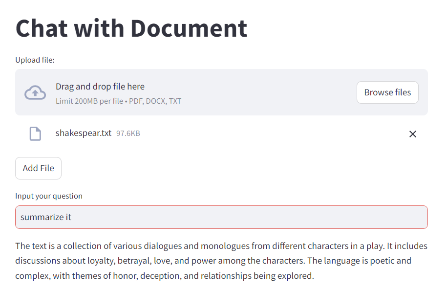
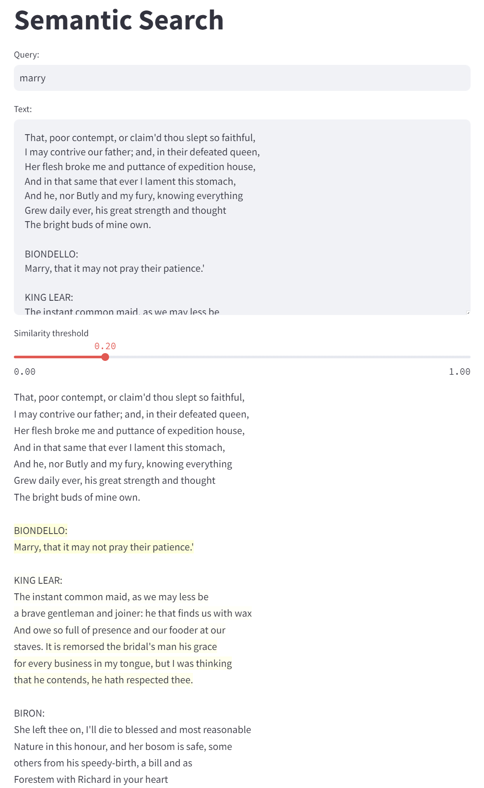
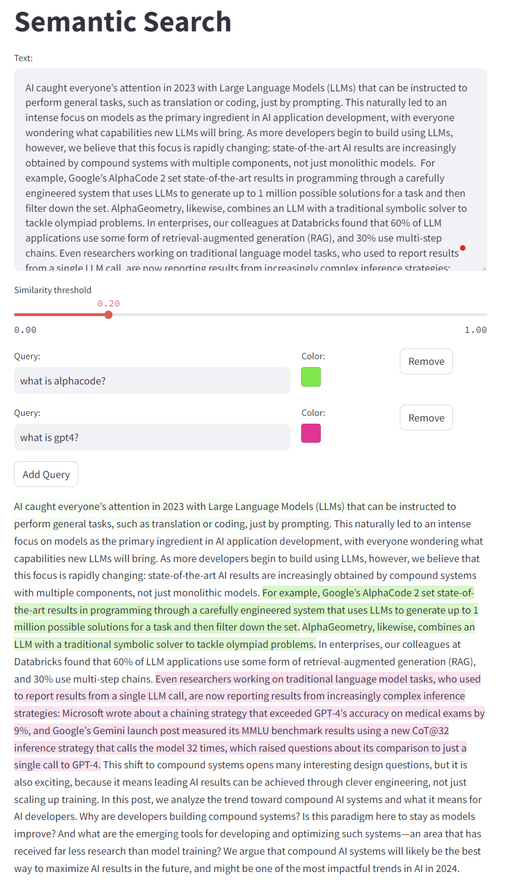
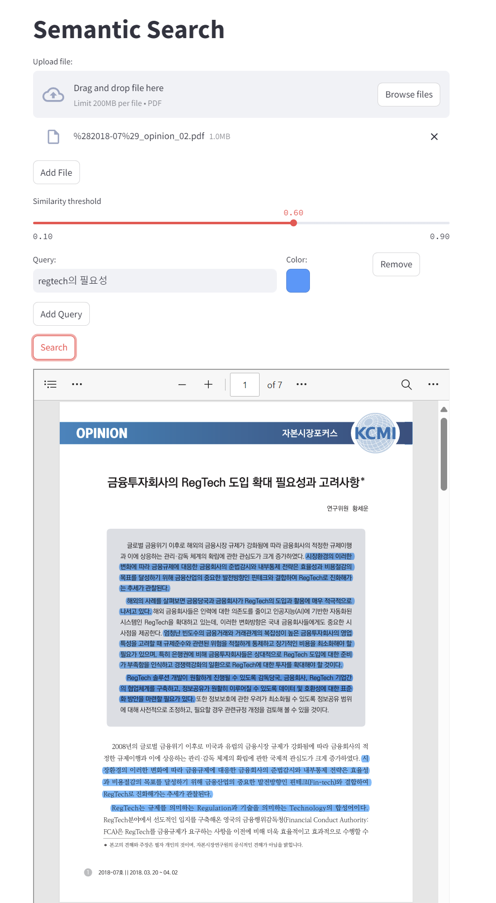

# Setup
## conda env (from environment.yml)
```bash
conda env create -f environment.yml
```
## pip install
```bash
pip install -r requirements.txt
```

# Run
```bash
streamlit run {file_name}.py 
```

# Files
- `app.py`
    - generate a medium article style title on given topic
    <details>
    <summary> example: </summary>
        
    </details>

- `doc.py`
    - chat (QA) with the documnet
    <details>
    <summary> example: </summary>
        
    </details>

- `search.py`
    - semantic search on the text
    - highlight the relevant sentences in the text based on the query
    - highlight strength is based on the similarity between the query and the sentence
    <details>
    <summary> example: </summary>
        
    </details>

- `search_m.py`
    - multi query semantic search on the text
    - you can set the highlight color for each query
    <details>
    <summary> example: </summary>
        
    </details>

- `highlight_pdf.py`
    - highlight the pdf based on the query
    <details>
    <summary> example: </summary>
        
    </details>

# Reference
- https://bair.berkeley.edu/blog/2024/02/18/compound-ai-systems/
- https://www.kcmi.re.kr/common/downloadw.php?fid=21997&fgu=002001&fty=004003
